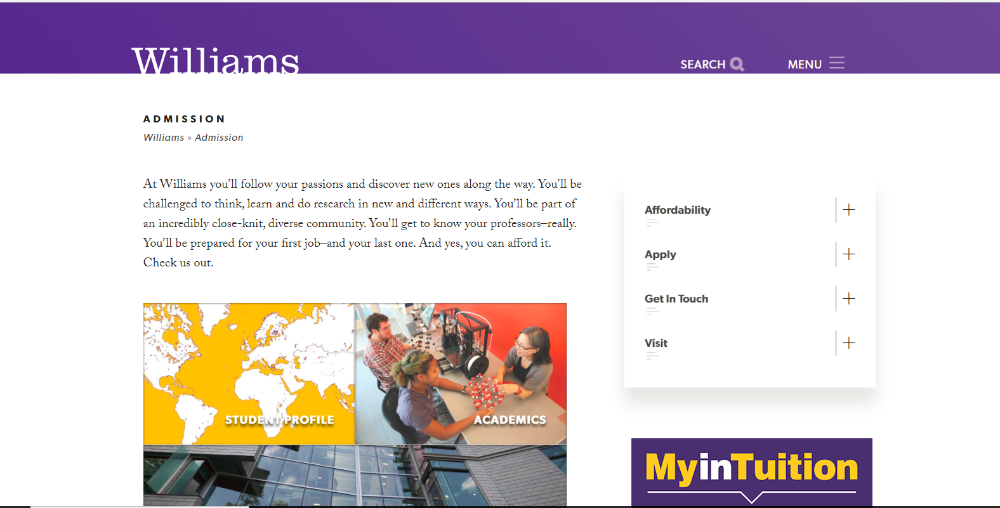
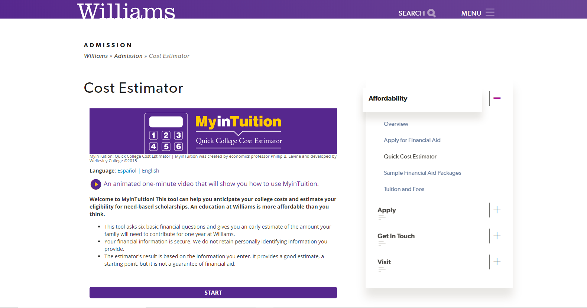

# Motivation

The college search process is an expensive and time-consuming, factors which can often prove prohibitive for potential college applicants.  Even when high schoolers are able to thoroughly research colleges and visit potential schools, it can be almost impossible to sort through the information provided and understand which school best suits their interests.  Admissions Offices, while crucial to the application process, often only offer a generic image of the school that gives little idea of what student life is really like (see figure 1).  Further, many of the best resources for learning about a college are only available to those candidates who can make it to campus.  Be it monetary restrictions, distance, or simple lack of genuine information, finding the right college is a difficult task.

*Figure 1. A screenshot of the Williams College Admissions Office home page ([]https://admission.williams.edu/).  Information provided by admissions offices is often vague.*

So how do we move past these limitations in the college search process?  How do we make useful information on schools accessible to everyone?  We move it into the wild.

# Idea

I want to improve the college search process by facilitating person-to-person discussions that both dig deeper than Admissions Office spiels and make the information accessible to all applicants, regardless of income or geography.  I believe that the best way to learn about a school and what it offers its students is by speaking directly to members of the school community.  To make this possible for everyone, I want to design an online platform (an app or website) that matches college applicants to current students based on academic and extra-curricular interests.  Applicants would be able to build profiles that describe their interests and the aspects of a school that are most important to them.  They would then choose colleges that they are interested in, and would be presented with students from those schools who have similar interests and participate in the aspects of student life that the applicants are interested in.  The platform would then facilitate personal discussion (text-based or video) between the applicants and students.  This would help bring the benefit of personal interaction to as many college applicants as possible, helping to present valuable information to as many applicants as possible.

# Analysis

While the current process of learning about colleges is flawed, some of its elements need to be incorporated into this platform to effectively serve the applicants using it.  Much of the information provided by Admissions Offices and other school administrators--things like financial aid guidance--is crucial to the college search process and likely cannot be effectively communicated by current college students (see figure 2).

*Figure 2.  A cost estimator on the Williams College Admissions Office website ([]https://admission.williams.edu/costestimator/).  Some information provided by Admissions Offices cannot be replaced by conversations.*

Where Admissions Offices fall short, however, is in the less factual side of the college search.  From my personal experiences with the college applications, listening to admissions officers talk about their school seems gimmicky and unconvincing--I never left one of these talks feeling that I knew what life at the school was really like.  Rather, the best source of information on the student experience at a school is its students.  Personal conversations with people at the school always provided me with a better picture of life on campus and the opportunities available in and outside of the classroom.  These conversations have, in the past, only been available to candidates able to visit campuses during their college search or who know current students at the schools they are interested in.  This project would work to close that gap, making this crucial part of the college selection process available to everyone.
